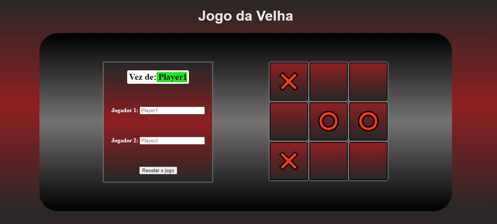

<h1 align="center">Projeto - Jogo da Velha</h1>
 

<h3 align="center">

[?&style=for-the-badge&logo=gmail&logoColor=white)](mailto:douglas.d.santos.dev@gmail.com) [.svg?&style=for-the-badge&logo=linkedin&logoColor=white)](https://www.linkedin.com/in/douglas-santos-8442b41ba/)

</h3>

---

## 💻 Tecnologias utilizadas

O projeto foi desenvolvido utilizando as seguintes tecnologias:

- **HTML**
- **CSS**
- **JavaScript**

---

Desenvolvido por ⚡ Douglas dos Santos.
 
